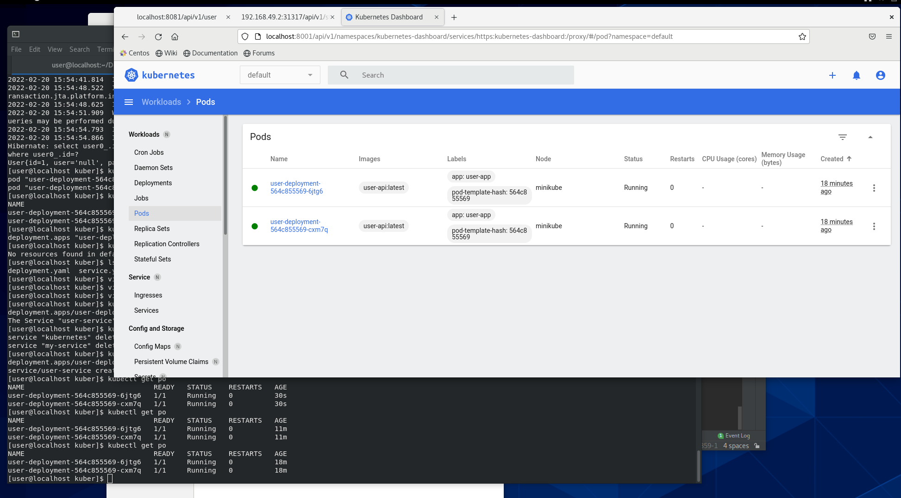

# Лабораторная работа №2: создание кластера Kubernetes и деплой приложения

Название дисциплины: Технологии разработки программного обеспечения

ФИО: 

Группа:

Цель лабораторной работы: знакомство с кластерной архитектурой на примере Kubernetes, а также деплоем приложения в кластер.

## Манифесты
[service.yaml](kuber/service.yaml)

[deployment.yaml](kuber/deployment.yaml)

## Манифесты для создания роли доступа к дашборбу
[cluster-role.yaml](dashboard-roles/cluster-role.yaml)

[dashboard-adminuser.yaml](dashboard-roles/dashboard-adminuser.yaml)
## Скриншоты выполнения

1. Два пода

2. 10 подов, доступ к эндопоинту status

3. 10 подов, доступ к эндпоинту пользователей
